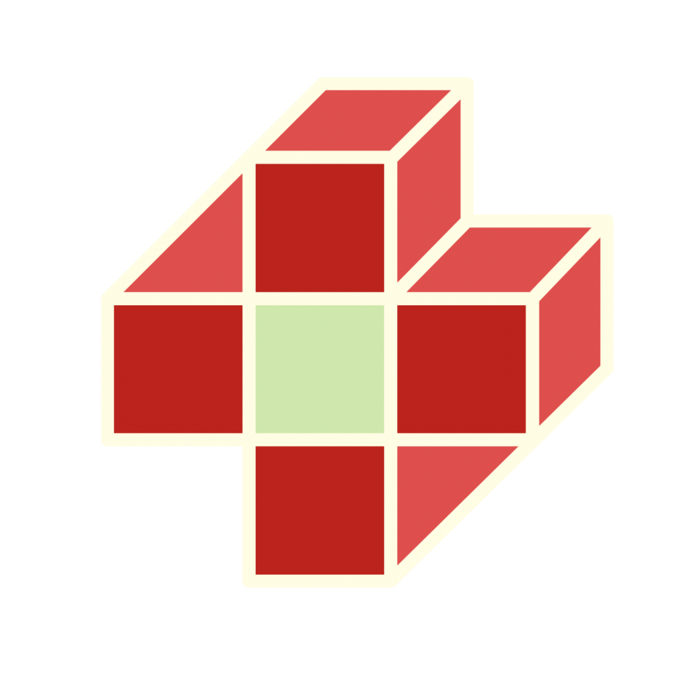

### Hi, I'm Zakaria Rhiba 👋 · Researcher & Founder @ **Zakpy Digital Solutions**

I'm a researcher working on **telemedicine and IoMT (Internet of Medical Things)** across its main axes: connected health architectures, **cybersecurity**, and **Big Data analysis & pipelines**.

Alongside my research, I run **Zakpy Digital Solutions**, where I help businesses scale through web apps, CRM systems, and automation workflows.

---

### 🚀 What Zakpy Digital Solutions does

I help businesses scale by replacing manual work with proper systems.

| Service | What's included |
|---|---|
| **Web Applications** | Business websites, client portals, dashboards |
| **CRM Systems** | Custom CRM setup and integration for sales & client management |
| **Automation Workflows** | Connecting tools, cutting manual tasks, streamlining operations |
| **Digital Consulting** | Picking the right stack and architecture to scale safely |

📚 I also share what I learn through **Zakpy Academy**, practical, no-fluff programming and tech content.

---

### 🛠️ Frameworks & Tools

**AI-assisted engineering:** Claude Code · OpenAI Codex · Agentic AI workflows · AI-driven automation pipelines

---

### 🤝 Let's work together

I'm open to freelance projects, collaborations and internships in software development, automation and IoT.

